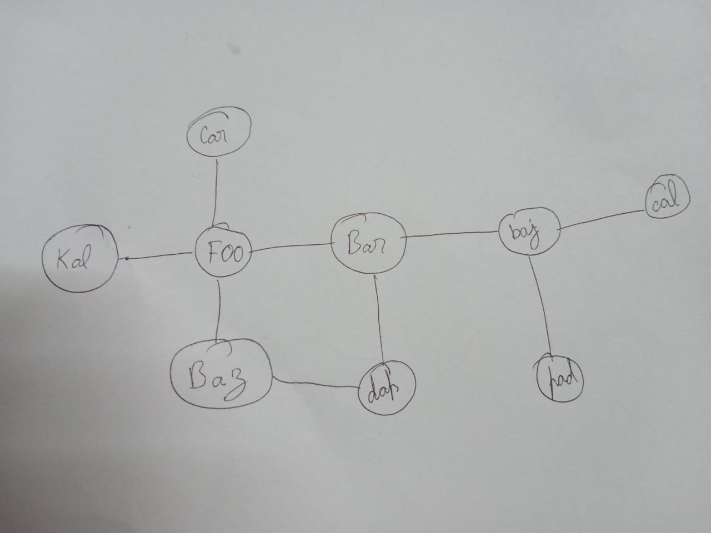

[](https://goreportcard.com/report/github.com/shravanshetty1/mad-aliens)

# Alien Invasion simulation

Program simulates an alien invasion of a world. Here is the [spec](./docs/spec.pdf).

## Usage
```
// install the command
go install ./cmd/maliens

// run the command with example map
maliens ./assets/map.txt --aliens 3
```

## Expected output
```
City Foo has been destroyed by aliens alien3, alien1
---
Invasion failed - cities still exist after 10000 iterations, following is the map of the remains
---
Bar east=Baj south=Dap
Baj east=Cal west=Bar south=Pad
Cal west=Baj
Kal
Car
Baz east=Dap
Dap north=Bar west=Baz
Pad north=Baj

---
```

## Assumptions
* Aliens wont destory the city they spawned in.
* If more than 2 aliens exist in city, all aliens and city will be destroyed.

## Example map layout
